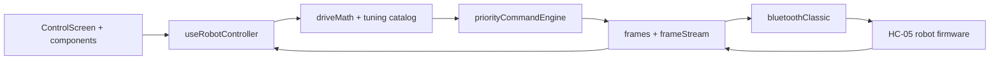

<p align="center">
  
</p>

<p align="center">
  
  
  
  
  
  
</p>

## Competition Robot Control

A single-screen, low-latency controller for HC-05 robots built with Expo, React Native, and Bluetooth Classic.

This UI is designed for fast, confident operation:

- Landscape-only control surface with no scrolling
- Joystick-only drive input
- Top bar for Bluetooth, Tuning, MANUAL/AUTO, and STOP
- Retro LCD telemetry panel with strong contrast
- Strict ASCII frame protocol with priority scheduling

## Visual Effects

The UI uses deliberate motion to feel tactile and readable:

- Entrance motion: panels rise in with staggered timing
- LCD refresh: scanline wipe on telemetry updates
- Bluetooth connect: soft breathing glow on status LED
- STOP pulse: short double pulse, then solid hold
- Control feedback: press scale to 0.98 for 120 ms

## Color Schema

Primary palette from `src/theme/palette.ts`:

<p>
  
  
  
  
  
  
</p>

## Architecture



## Photos

Create a folder named `Photos` and add your screenshots using the placeholders below.

<table>
  <tr>
    <td></td>
    <td></td>
  </tr>
  <tr>
    <td></td>
    <td></td>
  </tr>
  <tr>
    <td></td>
    <td></td>
  </tr>
  <tr>
    <td></td>
    <td></td>
  </tr>
  <tr>
    <td></td>
  </tr>
</table>

## Protocol

The app sends exactly one command per frame:

- `STOP;`
- `A=0;` or `A=1;`
- `M=L,R;` where `L` and `R` are integers in `-255..255`
- `S1=ANGLE;`, `S2=ANGLE;`, `S3=ANGLE;`
- `KEY=VALUE;` tuning frames (for example `TH=20;`)

The robot telemetry stream is parsed from:

- `T=front,left,right,mode,currentL,currentR;`

All frames are uppercase normalized and ASCII-safe.

## Tuning Keys

- Servo limits: `S1MIN`, `S1MAX`, `S2MIN`, `S2MAX`, `S3MIN`, `S3MAX`
- Core tuning: `KP`, `KD`, `SP`, `MS`, `TH`, `TS`, `NR`, `MD`, `PB`, `PV`
- Advanced tuning: `RA`, `RV`, `DZ`, `BR`, `CM`, `AV`, `PT`, `DP`, `DE`, `ST`, `BL`

## Project Structure

```text
.
|- App.tsx
|- src/
|  |- screens/ControlScreen.tsx
|  |- hooks/useRobotController.ts
|  |- comms/bluetoothClassic.ts
|  |- comms/priorityCommandEngine.ts
|  |- control/driveMath.ts
|  |- protocol/frames.ts
|  |- protocol/frameStream.ts
|  |- components/
```

## Build and Run

Bluetooth Classic requires a native build (Expo Go is not enough).

1. Install dependencies:

```bash
npm install
```

2. Build and run on Android:

```bash
npm run android
```

3. Start Metro for dev client:

```bash
npm run start
```

4. Run critical protocol/control tests:

```bash
npm run test
```

5. Type-check the app:

```bash
npm run typecheck
```

## Web Mode

The project can run as a website.

- Start web dev server:

```bash
npm run web
```

- Build static web output:

```bash
npm run build:web
```

- Preview production export locally:

```bash
npm run preview:web
```

Notes:

- Browser runtime cannot use Android Bluetooth Classic (HC-05) directly.
- The web build includes a safe simulated Bluetooth device (HC-05 Web Demo).
- For real HC-05 hardware control, use the Android app build.

## Deploy

You can deploy the generated web app directly:

1. Vercel:
  - Import this `mobile-app` folder.
  - `vercel.json` is included and configured for SPA routing and `dist` output.

2. Netlify:
  - Import this `mobile-app` folder.
  - `netlify.toml` is included and configured for build command and SPA redirect.

## APK Build (EAS)

1. Login:

```bash
eas login
```

2. Build cloud APK profile:

```bash
eas build -p android --profile apk
```

3. Build local APK profile:

```bash
eas build -p android --profile apk-local --local
```

## Firmware Pairing

Use the updated `CompetitionRobot.ino` in workspace root.

Telemetry from robot is expected as:

- `T=front,left,right,mode,currentL,currentR;`

Where `mode` is `A` or `M`.
